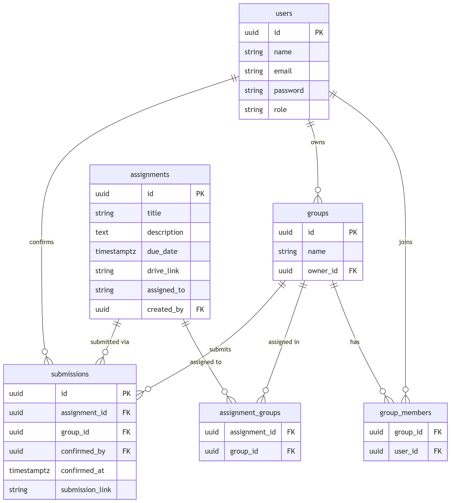
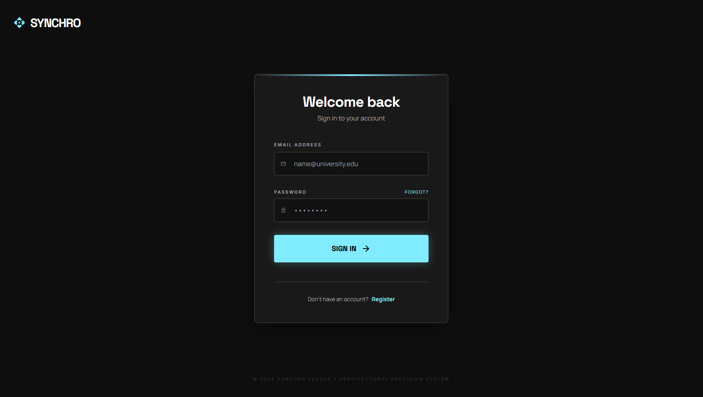
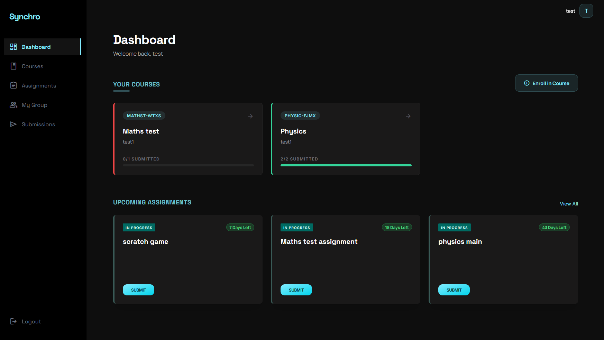
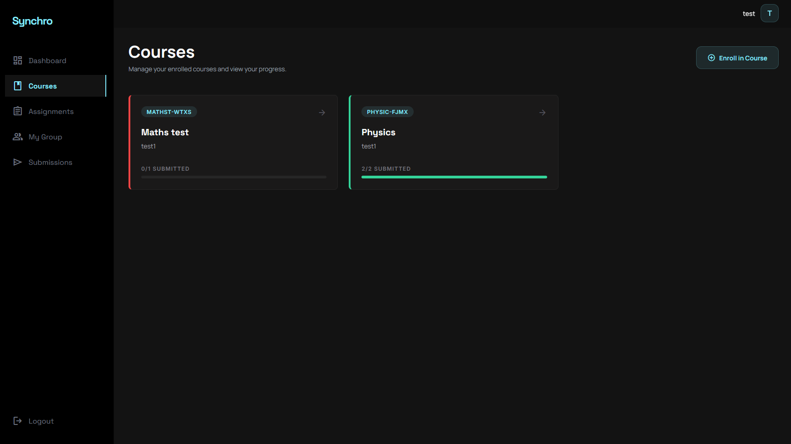
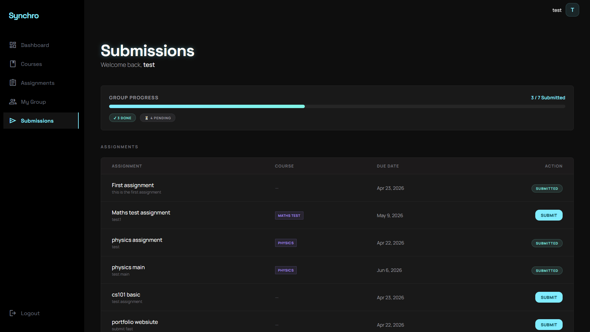
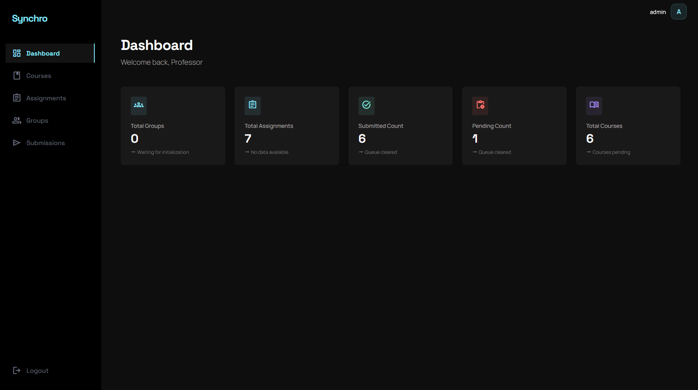
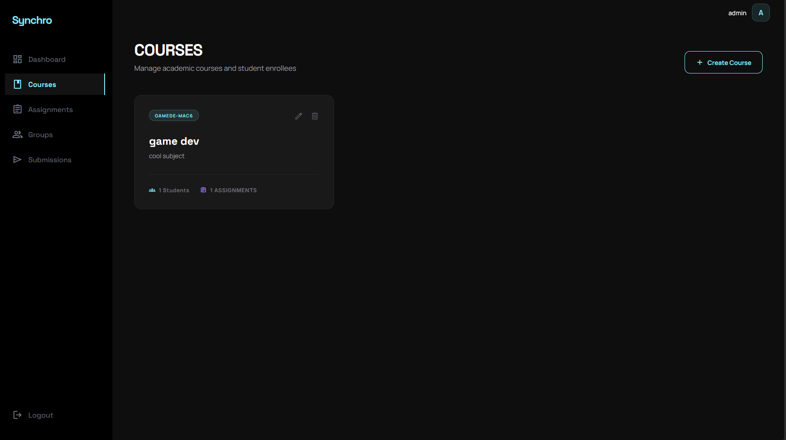

# ⚡ Synchro

> **Role-based Academic Assignment & Group Management System**  
> Built for Joineazy Full Stack Internship — Round 1 & Round 2

---

## 🌐 Live Demo

| Service | URL |
|---|---|
| **Frontend** | https://synchro-kappa.vercel.app |
| **Backend API** | https://synchro-backend.onrender.com |
| **Database** | MongoDB Atlas (cluster0.3a8kqey.mongodb.net) |

> ⚠️ The backend is hosted on Render's free tier — the first request after inactivity may take ~50 seconds to wake up. Subsequent requests are fast.

---

## 🎥 Demo Videos

| Round | Video |
|---|---|
| **Round 1** — Core functional prototype | [Watch on Loom](https://www.loom.com/share/545abd3bc6af415ca46f2f0c8458f6f4) |
| **Round 2** — UI/UX polish + MongoDB + Deployment | [Watch on Loom](https://www.loom.com/share/28992b5ac7a245418bc18823107c3cdd) |

---

## What is Synchro?

Synchro is a full-stack web application that bridges the gap between professors and students in academic group-based workflows.

Professors post assignments, students form groups, collaborate, and confirm submissions — all in one unified dark-themed interface. Built across two rounds, the app evolved from a functional prototype (PostgreSQL, local Docker) to a fully deployed, production-grade system (MongoDB Atlas, Vercel, Render).

---

## ✦ Features

### Student
- Register & login with JWT-secured sessions
- Enroll in courses using a course code shared by the professor
- View enrolled courses on the dashboard with submission progress bars
- Browse assignments per course or globally, with live countdown timers (green → yellow → red)
- Create groups, invite members by email, transfer group ownership
- Confirm group submission with a submission link (group leader only)
- Track group progress — submission status reflected across all group members instantly

### Admin (Professor)
- Create, edit, and delete courses — course code auto-generated
- Create, edit, and delete assignments — link to a course or assign globally
- Assign to all groups or specific groups only
- Monitor group-wise submission status with course column and status badges
- Analytics dashboard — total groups, courses, assignments, submitted, pending

---

## 🛠 Tech Stack

| Layer | Tech |
|---|---|
| Frontend | React + Vite + TypeScript + Tailwind CSS v3 |
| Backend | Node.js + Express + TypeScript |
| Database | **MongoDB + Mongoose** (migrated from PostgreSQL in Round 2) |
| Auth | JWT (role-based: student / admin) |
| Containers | Docker + docker-compose (local dev) |
| Frontend Deploy | Vercel |
| Backend Deploy | Render (Docker, free tier) |
| Cloud DB | MongoDB Atlas (M0 free cluster) |

---

## 🆕 What Changed in Round 2

| Area | Change |
|---|---|
| Database | Migrated from PostgreSQL (raw `pg`) → MongoDB + Mongoose |
| Models | Added `Course` model; `Assignment` now links to a course; `Submission` tracks status (`pending` / `confirmed` / `overdue`) |
| Backend | Added courses routes + analytics per course endpoint |
| Frontend | Full UI/UX overhaul — new pages, components, design system |
| New Pages | `StudentDashboard` (course cards), `Courses`, `CourseAssignments`, `AdminCourses` |
| New Components | `CourseCard` (progress bar), `AssignmentCard` (countdown timer), `EmptyState` |
| Polish | Toast notifications, inline form validation, loading states, status badges, animations |
| Deployment | Vercel (frontend) + Render (backend) + MongoDB Atlas (DB) — fully live |

---

## 🎨 UI/UX Design Choices

**Dark theme** — `#131313` page background, `#1a1919` cards, `#262626` inputs. Reduces eye strain for students working late, consistent with modern developer tooling aesthetics.

**Cyan accent (`#81ecff`)** — used for primary actions, active nav states, and progress indicators. High contrast against the dark background without being harsh.

**Countdown timer pills** — green (>24h), yellow (<24h), red (overdue). Students instantly know urgency without reading dates.

**Progress bars on course cards** — students see X/Y assignments submitted at a glance on the dashboard. No need to navigate into each course.

**Leader-only submission confirm** — only the group owner sees the confirm button. Status update reflects immediately for all group members via shared submission document.

**Toast notifications** — non-blocking feedback for all CRUD actions (group created, assignment deleted, submission confirmed, etc.). Auto-dismiss in 3 seconds.

**Sidebar navigation** — fixed left sidebar keeps context while switching between pages. Active route highlighted in cyan.

**Fonts** — Space Grotesk (headings), Manrope (body), Inter (data). Chosen for readability in data-dense interfaces.

---

## 🚀 Setup & Run

### Option 1 — Local with Docker (backend + MongoDB)

```bash
git clone https://github.com/Joy0810/Synchro.git
cd Synchro

# Start backend + MongoDB
docker-compose up -d --build db backend
```

Then run the frontend separately:

```bash
cd frontend
npm install
npm run dev
# http://localhost:5173
```

| Service | URL |
|---|---|
| Frontend (dev) | http://localhost:5173 |
| Backend API | http://localhost:4000 |
| MongoDB | mongodb://localhost:27017/synchro |

### Option 2 — Frontend only (against live backend)

```bash
cd frontend
npm install

# Create .env file
echo "VITE_API_URL=https://synchro-backend.onrender.com" > .env

npm run dev
```

### Environment Variables

**Backend (`backend/.env`):**
```
MONGO_URI=mongodb://db:27017/synchro
JWT_SECRET=your_jwt_secret
PORT=4000
```

**Frontend (`frontend/.env`):**
```
VITE_API_URL=http://localhost:4000
```

---

## 🔌 API Endpoints

### Auth
```
POST   /api/auth/register     { name, email, password, role }
POST   /api/auth/login        { email, password }  → { token, user }
GET    /api/auth/me           → current user from JWT
```

### Courses
```
GET    /api/courses                       → all courses (student: enrolled, admin: all)
POST   /api/courses                       [admin] { title, description } → courseCode auto-generated
PUT    /api/courses/:id                   [admin]
DELETE /api/courses/:id                   [admin]
POST   /api/courses/enroll               [student] { courseCode }
```

### Groups
```
GET    /api/groups                        → all groups (student: own, admin: all)
POST   /api/groups                        { name }
POST   /api/groups/:id/members            { email }
DELETE /api/groups/:id/members/:userId
DELETE /api/groups/:id
PATCH  /api/groups/:id/owner              { newOwnerId }
```

### Assignments
```
GET    /api/assignments                   → visible assignments
GET    /api/assignments/course/:courseId  → assignments for a course
POST   /api/assignments                   [admin] { title, description, dueDate, driveLink, assignedTo, groupIds?, courseId? }
PUT    /api/assignments/:id               [admin]
DELETE /api/assignments/:id               [admin]
```

### Submissions
```
POST   /api/submissions                   { assignmentId, groupId, submissionLink }
GET    /api/submissions/group/:groupId    → group's submissions
GET    /api/submissions/admin             [admin] → all submissions
```

### Analytics
```
GET    /api/analytics/overview            [admin] → { total_groups, total_courses, total_assignments, submitted_count, pending_count }
GET    /api/analytics/course/:courseId    [admin] → { total_assignments, submitted_count, pending_count }
```

> All responses follow: `{ success: true, data: { ... } }`

---

## 🗄 Database Schema

### MongoDB Models (Round 2)

```
User        → name, email, password (bcrypt), role (student|admin), enrolledCourses[]

Course      → title, description, courseCode (auto), createdBy, enrolledStudents[]

Group       → name, owner (→ User), members[] (→ User), course (→ Course)

Assignment  → title, description, dueDate, driveLink, createdBy, course (→ Course),
              assignedTo (all|specific), assignedGroups[]

Submission  → assignment (→ Assignment), group (→ Group), confirmedBy (→ User),
              confirmedAt, submissionLink,
              submissionStatus (pending | confirmed | overdue)
```

### Relationships

```
User ──< enrolledCourses >── Course
User ──< Group.members
Group.owner ──> User
Assignment.course ──> Course
Assignment.assignedGroups[] ──> Group
Submission ──> Assignment
Submission ──> Group
Submission.confirmedBy ──> User
```

### Round 1 Schema (PostgreSQL — for reference)

```sql
users           → id, name, email, password (bcrypt), role (student|admin)
groups          → id, name, owner_id (→ users)
group_members   → group_id, user_id  [composite PK]
assignments     → id, title, description, due_date, drive_link, assigned_to (all|specific)
assignment_groups → assignment_id, group_id
submissions     → id, assignment_id, group_id, confirmed_by, confirmed_at, submission_link
```

### Round 1 ER Diagram



---

## 🏗 Architecture

```
Browser (React + Vite)
    │
    │  HTTPS + JWT Bearer
    ▼
Express API (Node.js) — Render
    │  auth.middleware  →  verifyToken + requireRole
    │
    ├── routes/
    ├── services/   (business logic)
    └── models/     (Mongoose schemas)
         │
         ▼
    MongoDB Atlas (cloud)
```

**Auth Flow:**
1. Register → bcrypt hash → store in DB
2. Login → compare hash → sign JWT `{ userId, role, email }` 5h expiry
3. Frontend stores token in `localStorage`
4. Every request sends `Authorization: Bearer <token>`
5. Middleware verifies → attaches `req.user`
6. `requireRole('admin')` guards admin-only routes
7. On login: `student` → `/dashboard`, `admin` → `/admin/dashboard`
8. On 401 → clear localStorage → redirect to `/login`

---

## 📁 Project Structure

```
synchro/
├── docker-compose.yml
├── frontend/
│   ├── Dockerfile
│   └── src/
│       ├── api/            axios instance + JWT interceptor
│       ├── contexts/       AuthContext (login, logout, session restore)
│       ├── types/          TypeScript interfaces (User, Course, Group, Assignment, Submission)
│       ├── pages/
│       │   ├── auth/       Login, Register
│       │   ├── student/    Dashboard, Courses, CourseAssignments, Assignments, MyGroup, Submissions
│       │   └── admin/      Dashboard, Courses, Assignments, Groups, Submissions
│       └── components/
│           └── ui/         Navbar, AdminNavbar, CourseCard, AssignmentCard, GroupCard,
│                           SubmissionTable, EmptyState
└── backend/
    ├── Dockerfile
    └── src/
        ├── config/         Mongoose DB connection
        ├── middleware/      auth, error handling
        ├── models/         Mongoose schemas (User, Course, Group, Assignment, Submission)
        ├── services/       business logic layer
        └── routes/         Express routers
```

---

## 🐳 Docker Setup

```yaml
# docker-compose.yml
db:       mongo:7        → port 27017
backend:  port 4000      MONGO_URI: mongodb://db:27017/synchro
frontend: port 3000
```

```bash
# Start backend + DB only (recommended for development)
docker-compose up -d --build db backend

# View backend logs
docker-compose logs backend
# Expected: "Server is running on port 4000" + "Connected to MongoDB"
```

---

## 👤 Test Credentials

Register via `/register` — choose role `student` or `admin`.

Or use the live site: https://synchro-kappa.vercel.app

---

<div align="center">
  <sub>Built with focus by Joy — Joineazy Full Stack Internship, April 2026</sub>
</div>


## Screenshots

### Login


### Student Dashboard


### Student Courses


### Student Submissions


### Admin Dashboard


### Admin Courses
